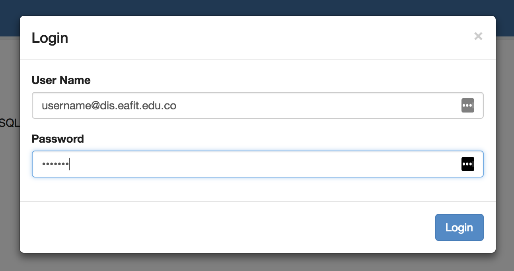

# Unidad 3: Big Data
## ST0263 - Tópicos Especiales en Telemática
## Ingeniería de Sistemas
## Universidad EAFIT
### Profesor: Edwin Montoya M. – emontoya@eafit.edu.co
## 2017-2

# LAB SPARK

* Se puede programar en python, scala o java.

* ejemplos en python:

1. De forma interactiva via 'pyspark'

// ya trae preconfigurado las variables sc y spark

    $ pyspark
    >>> files = sc.textFile("hdfs:///datasets/gutenberg-txt-es/*.txt")
    >>> counts = text_file.flatMap(lambda line: line.split(" ")).map(lambda word: (word, 1)).reduceByKey(lambda a, b: a + b)
    >>> counts.saveAsTextFile("hdfs:///tmp/wcout1")

    * asi salva counts un archivo por rdd.
    * si quiere que se consolide en un solo archivo de salida:

    $ pyspark
    >>> files = sc.textFile("hdfs:///datasets/gutenberg-txt-es/*.txt")
    >>> counts = text_file.flatMap(lambda line: line.split(" ")).map(lambda word: (word, 1)).reduceByKey(lambda a, b: a + b)
    >>> counts.coalesce(1).saveAsTextFile("hdfs:///tmp/wcout2")

2. Como un archivo python: [wc-spark.py](wc-spark.py)

``` Python
    from pyspark.sql import SparkSession

    spark = SparkSession.builder.appName("WordCount").getOrCreate()

    sc = spark.sparkContext

    text_file = sc.textFile("hdfs:///datasets/gutenberg-txt-es/*.txt")
    counts = text_file.flatMap(lambda line: line.split(" ")) \
                 .map(lambda word: (word, 1)) \
                 .reduceByKey(lambda a, b: a + b)
    counts.saveAsTextFile("hdfs:///user/emontoya/spout1")
```    

* correrlo:

    $ spark-submit --master yarn --deploy-mode cluster wc-spark.py

3. Desde Zeppelin Nodebook:

Entre desde un browser a: http://192.168.10.75:9995



Cree un Notebook:


